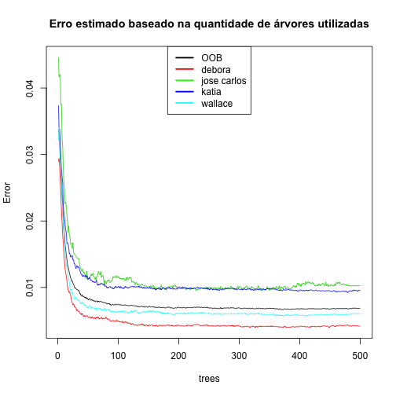
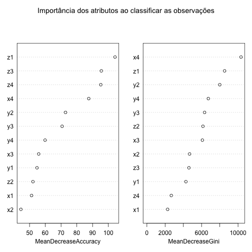
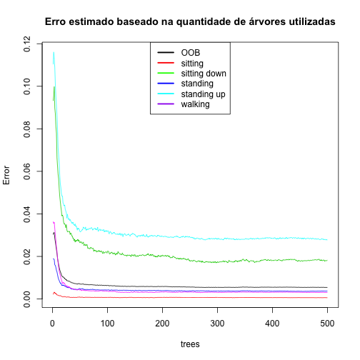
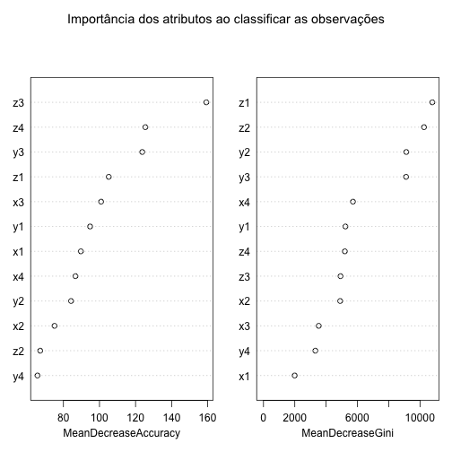
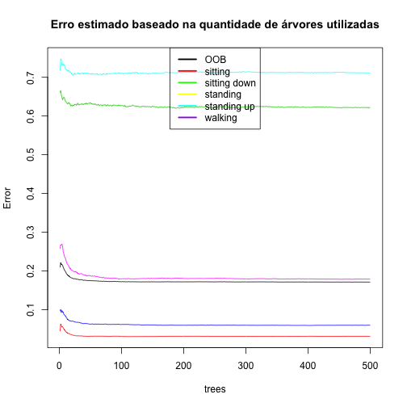

Reconhecimento de atividades humanas: cenário 01
================================================

O objetivo deste trabalho é construir um classificador de atividades realizadas por pessoas a partir
de informações coletadas de quatro acelerômetros localizados em lugares diferentes do
corpo da pessoa.

Aquisição dos dados
-------------------


```r
dataset <- read.csv("../data/dataset-har-PUC-Rio-ugulino.csv", sep = ";")
dim(dataset)
```

```
## [1] 165633     19
```

```r
sapply(dataset, class)
```

```
##               user             gender                age 
##           "factor"           "factor"          "integer" 
## how_tall_in_meters             weight    body_mass_index 
##           "factor"          "integer"           "factor" 
##                 x1                 y1                 z1 
##          "integer"          "integer"          "integer" 
##                 x2                 y2                 z2 
##          "integer"          "integer"          "integer" 
##                 x3                 y3                 z3 
##          "integer"          "integer"          "integer" 
##                 x4                 y4                 z4 
##          "integer"          "integer"          "integer" 
##              class 
##           "factor"
```

```r
table(dataset$user)
```

```
## 
##      debora jose_carlos       katia     wallace 
##       51577       13161       49797       51098
```

```r
table(dataset$class)
```

```
## 
##     sitting sittingdown    standing  standingup     walking 
##       50631       11827       47370       12415       43390
```

```r
prop.table(table(dataset$class))
```

```
## 
##     sitting sittingdown    standing  standingup     walking 
##     0.30568     0.07140     0.28599     0.07495     0.26196
```

```r
sum(is.na(dataset))
```

```
## [1] 0
```


Divisão entre conjunto de treinamento e testes
----------------------------------------------


```r
library(caret)
```

```
## Loading required package: lattice
## Loading required package: ggplot2
```

```r
set.seed(1234)
trainIndex <- createDataPartition(dataset$class, p = 0.6, list = FALSE, times = 1)
treinamento <- dataset[trainIndex, ]
teste <- dataset[-trainIndex, ]
```


Análise descritiva
------------------


```r
prop.table(table(treinamento$class))
```

```
## 
##     sitting sittingdown    standing  standingup     walking 
##     0.30568     0.07141     0.28599     0.07495     0.26196
```

```r
sapply(treinamento, summary)
```

```
## $user
##      debora jose_carlos       katia     wallace 
##       30858        7936       29873       30714 
## 
## $gender
##   Man Woman 
## 38650 60731 
## 
## $age
##    Min. 1st Qu.  Median    Mean 3rd Qu.    Max. 
##    28.0    28.0    31.0    38.3    46.0    75.0 
## 
## $how_tall_in_meters
##  1,58  1,62  1,67  1,71 
## 29873 30858  7936 30714 
## 
## $weight
##    Min. 1st Qu.  Median    Mean 3rd Qu.    Max. 
##    55.0    55.0    75.0    70.8    83.0    83.0 
## 
## $body_mass_index
##  22,0  24,0  28,4  28,6 
## 29873  7936 30714 30858 
## 
## $x1
##    Min. 1st Qu.  Median    Mean 3rd Qu.    Max. 
##   -73.0   -12.0    -6.0    -6.6     0.0   509.0 
## 
## $y1
##    Min. 1st Qu.  Median    Mean 3rd Qu.    Max. 
##     1.0    78.0    94.0    88.3   101.0   533.0 
## 
## $z1
##    Min. 1st Qu.  Median    Mean 3rd Qu.    Max. 
##  -603.0  -120.0   -98.0   -93.2   -64.0   411.0 
## 
## $x2
##    Min. 1st Qu.  Median    Mean 3rd Qu.    Max. 
##  -494.0   -35.0    -9.0   -87.9     4.0   473.0 
## 
## $y2
##    Min. 1st Qu.  Median    Mean 3rd Qu.    Max. 
##  -517.0   -29.0    27.0   -52.2    86.0   241.0 
## 
## $z2
##    Min. 1st Qu.  Median    Mean 3rd Qu.    Max. 
##    -617    -141    -118    -175     -29     122 
## 
## $x3
##    Min. 1st Qu.  Median    Mean 3rd Qu.    Max. 
##  -499.0     9.0    22.0    17.3    34.0   499.0 
## 
## $y3
##    Min. 1st Qu.  Median    Mean 3rd Qu.    Max. 
##    -506      95     107     104     120     517 
## 
## $z3
##    Min. 1st Qu.  Median    Mean 3rd Qu.    Max. 
##  -613.0  -103.0   -90.0   -93.9   -80.0   410.0 
## 
## $x4
##    Min. 1st Qu.  Median    Mean 3rd Qu.    Max. 
##    -702    -190    -168    -168    -153     -16 
## 
## $y4
##    Min. 1st Qu.  Median    Mean 3rd Qu.    Max. 
##  -526.0  -103.0   -91.0   -92.6   -80.0    86.0 
## 
## $z4
##    Min. 1st Qu.  Median    Mean 3rd Qu.    Max. 
##    -537    -167    -160    -160    -153     -56 
## 
## $class
##     sitting sittingdown    standing  standingup     walking 
##       30379        7097       28422        7449       26034
```


```r
par(mfrow = c(3, 2))
with(treinamento[treinamento$class == "sitting", ], hist(x1, xlim = c(-350, 
    200), main = "sitting", col = "cyan"))
with(treinamento[treinamento$class == "sittingdown", ], hist(x1, xlim = c(-350, 
    200), main = "sitting down", col = "cyan"))
with(treinamento[treinamento$class == "standing", ], hist(x1, xlim = c(-350, 
    200), main = "standing", col = "cyan"))
with(treinamento[treinamento$class == "standingup", ], hist(x1, xlim = c(-350, 
    200), main = "standing up", col = "cyan"))
with(treinamento[treinamento$class == "walking", ], hist(x1, xlim = c(-350, 
    200), main = "walking", col = "cyan"))
```

 


```r
par(mfrow = c(1, 1))
plot(treinamento[, 7:9], pch = 21, bg = c("red", "green", "black", "yellow", 
    "cyan")[treinamento$class], main = "Distribuição das atividades levando-se em consideração dados do sensor 1")
```

 


Criando o modelo
----------------


```r
library(randomForest)
```

```
## randomForest 4.6-7
## Type rfNews() to see new features/changes/bug fixes.
```

```r
formula <- class ~ x1 + y1 + z1 + x2 + y2 + z2 + x3 + y3 + z3 + x4 + y4 + z4
model <- randomForest(formula, data = treinamento, do.trace = 100, importance = TRUE)
```

```
## ntree      OOB      1      2      3      4      5
##   100:   0.64%  0.07%  2.25%  0.43%  3.20%  0.37%
##   200:   0.59%  0.07%  2.07%  0.39%  2.94%  0.34%
##   300:   0.54%  0.07%  1.76%  0.37%  2.81%  0.30%
##   400:   0.55%  0.06%  1.82%  0.37%  2.85%  0.32%
##   500:   0.54%  0.06%  1.82%  0.37%  2.77%  0.30%
```

```r
model
```

```
## 
## Call:
##  randomForest(formula = formula, data = treinamento, do.trace = 100,      importance = TRUE) 
##                Type of random forest: classification
##                      Number of trees: 500
## No. of variables tried at each split: 3
## 
##         OOB estimate of  error rate: 0.54%
## Confusion matrix:
##             sitting sittingdown standing standingup walking class.error
## sitting       30361           4        0         14       0   0.0005925
## sittingdown       3        6968       23         60      43   0.0181767
## standing          0           0    28316          8      98   0.0037295
## standingup        8          77       53       7243      68   0.0276547
## walking           0          14       47         18   25955   0.0030345
```


```r
plot(model, lty = c(1, 1, 1, 1, 1, 1), main = "Erro estimado baseado na quantidade de árvores utilizadas")
legend("top", c("OOB", "sitting", "sitting down", "standing", "standing up", 
    "walking"), lty = c(1, 1, 1, 1, 1, 1), lwd = c(2.5, 2.5, 2.5, 2.5, 2.5, 
    2.5), col = c("black", "red", "green", "blue", "cyan", "purple"))
```

 


```r
varImpPlot(model, main = "Importância dos atributos ao classificar as observações")
```

 


Outro modelo utilizando apenas dados do acelerômetro localizado na cintura
--------------------------------------------------------------------------


```r
formula1 <- class ~ x1 + y1 + z1
model1 <- randomForest(formula1, data = treinamento, do.trace = 100, importance = TRUE)
```

```
## ntree      OOB      1      2      3      4      5
##   100:  17.22%  3.10% 62.69%  6.20% 70.98% 17.93%
##   200:  17.18%  3.14% 62.14%  6.00% 71.28% 18.04%
##   300:  17.18%  3.13% 62.36%  6.02% 71.38% 17.95%
##   400:  17.14%  3.14% 62.24%  5.94% 71.18% 17.95%
##   500:  17.12%  3.14% 62.20%  6.00% 71.02% 17.88%
```

```r
model1
```

```
## 
## Call:
##  randomForest(formula = formula1, data = treinamento, do.trace = 100,      importance = TRUE) 
##                Type of random forest: classification
##                      Number of trees: 500
## No. of variables tried at each split: 1
## 
##         OOB estimate of  error rate: 17.12%
## Confusion matrix:
##             sitting sittingdown standing standingup walking class.error
## sitting       29426          34      654         43     222     0.03137
## sittingdown     147        2683     1405        347    2515     0.62195
## standing        373         109    26717         94    1129     0.05999
## standingup      172         558     1483       2159    3077     0.71016
## walking         207         674     3053        721   21379     0.17880
```


```r
plot(model1, lty = c(1, 1, 1, 1, 1, 1), main = "Erro estimado baseado na quantidade de árvores utilizadas")
legend("top", c("OOB", "sitting", "sitting down", "standing", "standing up", 
    "walking"), lty = c(1, 1, 1, 1, 1, 1), lwd = c(2.5, 2.5, 2.5, 2.5, 2.5, 
    2.5), col = c("black", "red", "green", "yellow", "cyan", "purple"))
```

 


Validando o modelo completo no conjunto de teste
------------------------------------------------


```r
testPred <- predict(model, newdata = teste)
t <- table(testPred, teste$class)
confusionMatrix(t)
```

```
## Confusion Matrix and Statistics
## 
##              
## testPred      sitting sittingdown standing standingup walking
##   sitting       20236           2        0          3       0
##   sittingdown       0        4651        0         54      20
##   standing          0          14    18879         39      43
##   standingup       16          39        6       4819       9
##   walking           0          24       63         51   17284
## 
## Overall Statistics
##                                         
##                Accuracy : 0.994         
##                  95% CI : (0.994, 0.995)
##     No Information Rate : 0.306         
##     P-Value [Acc > NIR] : <2e-16        
##                                         
##                   Kappa : 0.992         
##  Mcnemar's Test P-Value : NA            
## 
## Statistics by Class:
## 
##                      Class: sitting Class: sittingdown Class: standing
## Sensitivity                   0.999             0.9833           0.996
## Specificity                   1.000             0.9988           0.998
## Pos Pred Value                1.000             0.9843           0.995
## Neg Pred Value                1.000             0.9987           0.999
## Prevalence                    0.306             0.0714           0.286
## Detection Rate                0.305             0.0702           0.285
## Detection Prevalence          0.306             0.0713           0.286
## Balanced Accuracy             1.000             0.9910           0.997
##                      Class: standingup Class: walking
## Sensitivity                     0.9704          0.996
## Specificity                     0.9989          0.997
## Pos Pred Value                  0.9857          0.992
## Neg Pred Value                  0.9976          0.999
## Prevalence                      0.0750          0.262
## Detection Rate                  0.0727          0.261
## Detection Prevalence            0.0738          0.263
## Balanced Accuracy               0.9846          0.997
```


