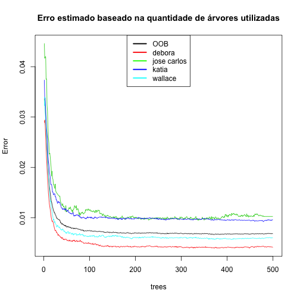
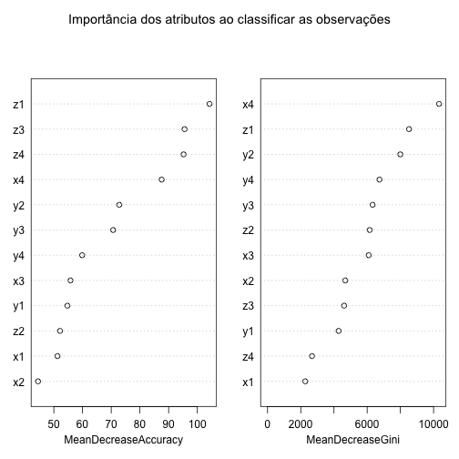

Reconhecimento de atividades humanas: cenário 02
========================================================

O objetivo deste trabalho é construir um classificador capaz de identificar a pessoa que está realizando determinado movimento a partir de informações coletadas de quatro acelerômetros localizados em lugares diferentes do corpo desta pessoa.

Aquisição dos dados
-------------------


```r
dataset <- read.csv("../data/dataset-har-PUC-Rio-ugulino.csv", sep = ";")
dim(dataset)
```

```
## [1] 165633     19
```

```r
table(dataset$user)
```

```
## 
##      debora jose_carlos       katia     wallace 
##       51577       13161       49797       51098
```

```r
prop.table(table(dataset$user))
```

```
## 
##      debora jose_carlos       katia     wallace 
##     0.31139     0.07946     0.30065     0.30850
```


Divisão entre conjunto de treinamento e testes
----------------------------------------------


```r
library(caret)
```

```
## Loading required package: lattice
## Loading required package: ggplot2
```

```r
set.seed(1234)
trainIndex <- createDataPartition(dataset$user, p = 0.6, list = FALSE, times = 1)
treinamento <- dataset[trainIndex, ]
teste <- dataset[-trainIndex, ]
```


Criando o modelo
----------------


```r
library(randomForest)
```

```
## randomForest 4.6-7
## Type rfNews() to see new features/changes/bug fixes.
```

```r
formula <- user ~ x1 + y1 + z1 + x2 + y2 + z2 + x3 + y3 + z3 + x4 + y4 + z4
model <- randomForest(formula, data = treinamento, do.trace = 100, importance = TRUE)
```

```
## ntree      OOB      1      2      3      4
##   100:   0.75%  0.49%  1.14%  1.01%  0.65%
##   200:   0.70%  0.43%  1.01%  0.99%  0.61%
##   300:   0.69%  0.43%  1.01%  0.97%  0.61%
##   400:   0.68%  0.41%  1.05%  0.95%  0.58%
##   500:   0.68%  0.41%  1.03%  0.96%  0.60%
```

```r
model
```

```
## 
## Call:
##  randomForest(formula = formula, data = treinamento, do.trace = 100,      importance = TRUE) 
##                Type of random forest: classification
##                      Number of trees: 500
## No. of variables tried at each split: 3
## 
##         OOB estimate of  error rate: 0.68%
## Confusion matrix:
##             debora jose_carlos katia wallace class.error
## debora       30819           0    57      71    0.004136
## jose_carlos      6        7816    34      41    0.010257
## katia          138          24 29593     124    0.009572
## wallace         47          20   117   30475    0.006002
```


```r
plot(model, lty = c(1, 1, 1, 1, 1), main = "Erro estimado baseado na quantidade de árvores utilizadas")
legend("top", c("OOB", "debora", "jose carlos", "katia", "wallace"), lty = c(1, 
    1, 1, 1, 1), lwd = c(2.5, 2.5, 2.5, 2.5, 2.5), col = c("black", "red", "green", 
    "blue", "cyan"))
```

 


```r
varImpPlot(model, main = "Importância dos atributos ao classificar as observações")
```

 


Validando o modelo com o conjunto de testes
-------------------------------------------


```r
testPred <- predict(model, newdata = teste)
t <- table(testPred, teste$user)
confusionMatrix(t)
```

```
## Confusion Matrix and Statistics
## 
##              
## testPred      debora jose_carlos katia wallace
##   debora       20559           4    98      40
##   jose_carlos      1        5216    14      11
##   katia           34          15 19711      62
##   wallace         36          29    95   20326
## 
## Overall Statistics
##                                         
##                Accuracy : 0.993         
##                  95% CI : (0.993, 0.994)
##     No Information Rate : 0.311         
##     P-Value [Acc > NIR] : < 2e-16       
##                                         
##                   Kappa : 0.991         
##  Mcnemar's Test P-Value : 1.12e-08      
## 
## Statistics by Class:
## 
##                      Class: debora Class: jose_carlos Class: katia
## Sensitivity                  0.997             0.9909        0.990
## Specificity                  0.997             0.9996        0.998
## Pos Pred Value               0.993             0.9950        0.994
## Neg Pred Value               0.998             0.9992        0.996
## Prevalence                   0.311             0.0795        0.301
## Detection Rate               0.310             0.0787        0.298
## Detection Prevalence         0.312             0.0791        0.299
## Balanced Accuracy            0.997             0.9952        0.994
##                      Class: wallace
## Sensitivity                   0.994
## Specificity                   0.997
## Pos Pred Value                0.992
## Neg Pred Value                0.998
## Prevalence                    0.309
## Detection Rate                0.307
## Detection Prevalence          0.309
## Balanced Accuracy             0.995
```

